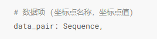

# 任务8

## 任务概述
    分析车次覆盖情况：根据城市信息，分析从一线城市发出的列车覆盖情况，绘制不同一线城市的列车行动轨迹地图。  

## 主要思路
+ 在开始任务之前，不要急着去写代码，而是要先对任务进行分析，透过问题看本质，把任务抽象化。
+ 先在脑海里思考下面几个问题：
  + *题目重点是什么*
  + *我要用什么图来表达这些数据*
  + *我用的这个图它需要什么形式的数据*
+ ***题目重点*** 因为题目要求分析的是一线城市到其他城市，而从源数据中的出发站/到达站可以映射出一线城市/其他城市（任务5实现），所以数据的映射关系应该是一线城市一一对应其他城市
+ ***可视化*** 重点在于题目的列车行动轨迹地图，那么就肯定是中国地图，在地图中有两个组件，一个是散点图（scatter），一个是线图（line）。这样可以实现点对点的显示
+ ***数据形式*** 
  + ***Scatter*** [(城市名,数量), (城市名,数量), ......]
  + ***Line*** [(一线城市名, 其他城市名), ......]   
  
  
  + ***实现思路*** 
    + 任务8在接口中由两个函数实现：***def _d_t_d(self, c1, c2)*** 和 ***def train_track(self, city)*** 其中 ***_d_t_d*** 生成一个装有一线城市、其他城市、以及数量的Dataframe
    ***train_track*** 对这个Dataframe进行处理，清洗出Scatter和Line的对应数据
    + ```python
      def _d_t_d(self, c1, c2)
      ```
      + 最终数据形式    
        
      + 为了清洗出这样的数据形式，第一步就是统计数据源中'dep_to_dest'字段下的出现次数
      ```python
      count_d = high_speed_rail_info['dep_to_dest'].value_counts()
      ```
      得出数据如下（数据类型Series）   
      
      + 这里我们规定列名为一线城市，行名为其他城市，值为一线城市到达其他城市的数量，也就是上图的值
      + 接下来，获得出发站和到达站的城市列表C2， C1并去重，从而获得在数据中出现过的所有城市的名字
      ```python
      # 去重
      c2 = set(city2)
      c1 = set(city1)
      ```  
      
      + 构建Dataframe
      ```python
        # 新建Dataframe表
        dep_dest_pd = pd.DataFrame(columns=c2, index=c1)
      ```  
        
      可以看到此时数据都还为nan，所以需要将***count_d***的数据导入dataframe中，这里我的思路是拆分***count_d***的index然后用loc将数据传入***dep_dest_pd***中，到上一步的时候已经完全可以作图了
      ```python
        # 获取索引，形式如 "上海-长春"
        ls_index = list(count_d.index)
  
        # 在新建表中添加数据
          for i in ls_index:
             a, b = i.split("-")
             dep_dest_pd.loc[b, a] = count_d.loc[i]
        # 将数据为nan的值改为0,因为为nan的数据代表这两座城市没有车次
        dep_dest_pd = dep_dest_pd.replace(np.nan, 0)
      ```  
      一顿操作后最后就得到了数据的最终形式
    + ```python
      # city为传入的单个一线城市名
      def train_track(self, city)
      ```
      + 调用 ***_d_t_d*** 函数得到处理好的数据,其中 ***self.st_df*** 是源数据
      ```python
      d = self._d_t_d(self.st_df['des_city'].tolist(), self.st_df['dep_city'].tolist())
      ```  
      + 清洗Line的数据（d_list）
      ```python
      # 只取当前city列的数据
      d_l = d[city]
      # 取不为0的值
      d_l = d_l[d_l != 0]

      # 取索引，索引形式为：常州、泰州等
      d_l_i = list(d_l.index)
      d_list = []
      # 打包数据
      for i in d_l_i:
         d_list.append((city, i))
      ```
      + 清洗Scatter的数据（scatter）
      ```python
        # 准备散点图数据，形式为('城市': 值(int))
        scatter = []

        # 最大最小值，画图用
        max_num = max(d_l)
        min_num = min(d_l)
        
        # i -> ('成都', '泰州')
        for i in d_list:
            # i[1] -> '泰州' 此行意思为取d_l中i[1]行的数据
            d_tmp = int(d_l[i[1]])
            # 如: ('泰州', 1000)
            scatter.append([i[1], d_tmp])
        # 数据顺序依次为Line、Scatter、最大最小值
        convert_data = [d_list, scatter, max_num, min_num]
      ```
      
## 函数
+ Pandas
  + `value_counts()` 计算当前列的每个值的出现次数，在Dataframe中使用并且调用该函数的变量type为Series
  + `loc` 用字符串取数据，如 a.loc[:, ['xx', 'xxx', 'xxxx']]， 逗号左边表示行右边表示列，':' 表示取所有数据
  + `iloc` 用索引取数据，如 a.loc[:, 2: 6]， 这里表示取2-5列的所有数据，如果要取到最后一行可以是 a.loc[:, 2: -1]
  + `tolist()` 将Series转化为list类型
  + 可以使用max/min直接获取Series中的最大值/最小值

+ Pyecharts
  + Pyecharts的构成其实非常简单并且模块化，画图最开始肯定是需要确定图的类型如柱状图（Bar）、线图（Line）、地图（Map）或者地理坐标图（Geo）
  任务8所用的就是Geo，因为需要建立点到点的关系。在建立完图之后，用`add()`在图上加入另外的图如散点图、线图（套娃），再加上相关的设置就构成了任务8的图
  + `Geo()` 声明一个Geo对象，也就是上文的第一步，在Geo的参数中有一个叫***init_opts***，是用来做初始化选项的，如长宽、背景颜色等
  + `add_scheme()` 用来定义地图类型如中国、美国、世界地图等
  + `add()` 加入另外的图
    + `type`_ 图类型
    + `is_polyline` 是否开启多线
    + `data_pair` 传入数据
    + `linestyle_opts` 线的相关设置，详情可以pyecharts官方文档或者csdn帖子，这里有一个小技巧，当width为0的时候就可以实现动态的点
    + `effect_opts` 更深入的设置，里面由很多参数，详情可以pyecharts官方文档或者csdn帖子
    + `symbol_size` 设置线/点的大小
  + `JsCode` 用于 ***linestyle_opts*** 的formatter参数里面，实际上只是一段字符串（包含着javascript的代码），在渲染到html的时候变成html可识别的 js匿名函数
  使pyecharts参数调整更多元化
  + `set_global_opts` 设置全局参数
    + `visualmap_opts` 和散点大小渲染有关，详情可以pyecharts官方文档或者csdn帖子

## 关于如何学习

### 编程思维
  + 人的固有思维和编程思维有着很大区别，所以转变思维至关重要，这也是大学期间最重要的事。对于Python来说，必须要理解面向对象编程概念、理解一切皆为对象这句话，相关的书籍推荐
《Python编程 从入门到实践》（黄色封面，有条蛇的那个）、《JAVA编程思维》（虽然这本书是java相关的，但是其对于面向对象这个概念讲得很透彻）

### Pandas
  + 关于pandas的相关资料有很多，可以先从我之前发在群上的那个入手，那个对于打基础非常好，东西不难，而且有solution。
  + 其次就是pandas的[官方文档](https://pandas.pydata.org/pandas-docs/stable/reference/index.html), 虽然都是全英文，但是这里面包含了所有pandas的函数，对应的函数
还有相关的例子，csdn的教程有部分搬运于此。也可以找国内的中文版（可能有吧）
  + 在[Kaggle](https://www.kaggle.com/)上找相关的项目，照猫画虎。这里推荐一个项目[Customer Segmentation](https://www.kaggle.com/code/fabiendaniel/customer-segmentation)
### Pyecharts
  + [Pyecharts官网](https://pyecharts.org/#/zh-cn/intro)里面有对每一个类、函数、参数的解释
  + [Echarts官网示例](https://echarts.apache.org/examples/zh/index.html) 因为pyecharts其实就是用python来渲染html，和echarts是一个东西
所以这些示例也可以用pyecharts来完成，在需要数据可视化的时候，可以来这个官网实例找找，并且研究一下代码。以下为操作示例：
    

  + 以下是修改出来的代码  
```python
e = (
    Pie(init_opts=opts.InitOpts(bg_color='#2c343c', animation_opts=opts.AnimationOpts(animation_easing='elasticOut')))
    .add("USA", pie,
         radius='55%',
         center=['50%', '50%'],
         rosetype='radius',
         label_opts={
             'color': 'rgba(255, 255, 255, 0.3)',
             'smooth': 0.2,
             'length': 10,
             'length2': 20
         },
    )
    .set_series_opts(
        linestyle_opts={
            'color': 'rgba(255, 255, 255, 0.3)',

        },
        itemstyle_opts={
            'color': '#c23531',
            'shadowBlur': 200,
            'shadowColor': 'rgba(0, 0, 0, 0.5)',
        },


    )
    .set_global_opts(
        title_opts={
            'text': 'Age Groups',
            'left': 'center',
            'top': 20,
            'textStyle': {
            'color': '#ccc'
            }
        },
        tooltip_opts={
            'trigger': 'item'
        },
        visualmap_opts={
             'show': False,
             'min': min_d,
             'max': max_d,
             'inRange': {
                'colorLightness': [0.3, 0.6]
              }
        },
    )
   
)
```
  
  + 如果在当前页面看不到相关数据，可以以下操作

  

## 写在最后
  + 在学习完概念之后必须要实践，计算机学科不同其他学科只是学概念，这更是一个非常需要实践的科目。很多人都是学了理论没有实践，最后理论也忘了。每多做一点项目
自己的储备也就更多，之后再遇到同样的问题就可以更快地解决。
  + 在写代码的时候应该要想着”这段代码是否可以优化“、”如果可以的话，我应该怎么样才能将其做得更好“。一个功能可以有很多实现方法，但是速度快慢、代码简易程度有着天壤之别
  + 不要觉得自己很弱，要勇于试错，每经历一个报错，都要刨根问底，不解决决不罢休，这样才能真正提高
  + 在前期简短，照猫画虎非常重要，读懂别人的代码并且自己实现了一遍，实际上也是有很大提升的，因为你可以由此知道，哦，原来还可以这么玩。（就跟打游戏看别人攻略一样）
  + 英语能力一定要提高，毕竟计算机是老外发明的，很多文档如pandas、spark等都是英文文档，读别人的翻译文档始终是没那味的，要读就读原版。同时英语能力的提高以为着
可以看懂国外的计算机相关论文，更可以了解到当前全球形势。此外，非常多的国人也都是发英文期刊。
  + 推荐的论文搜索引擎有：Google Scholar（最推荐）, Web of science, 百度学术
  + 时间充足的情况下，最好以看书为主（看个人情况，b站也可以）,看专业书对于打基础更有利。


